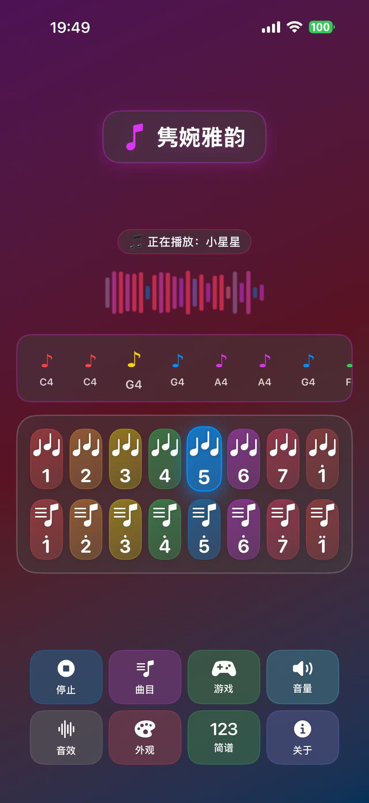
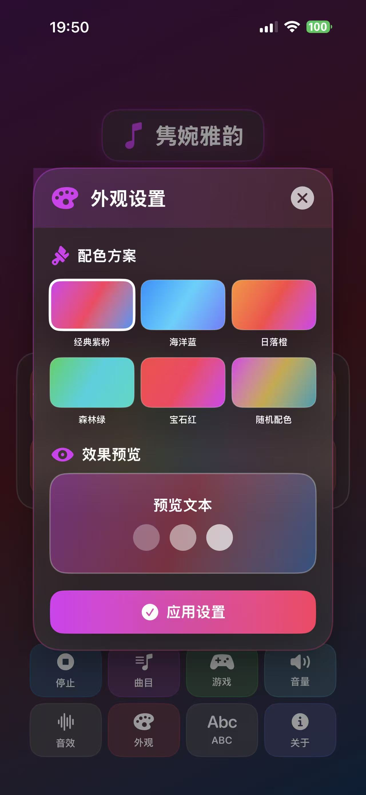
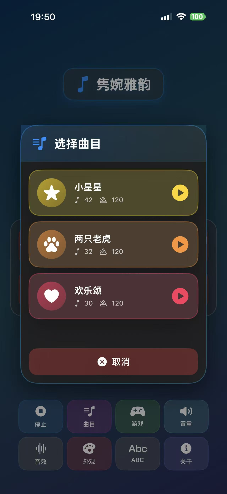
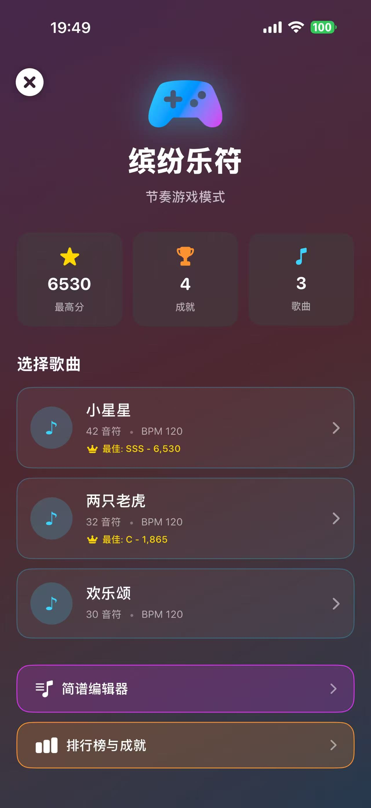
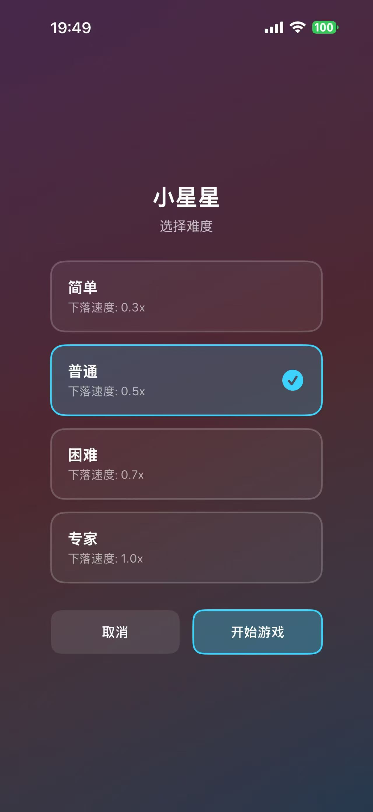
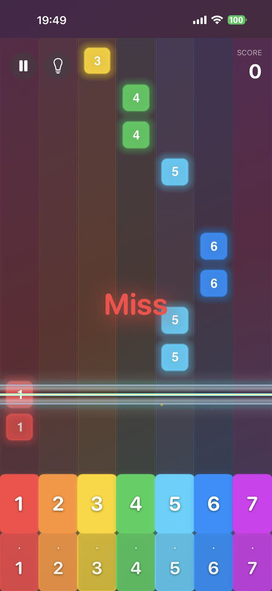
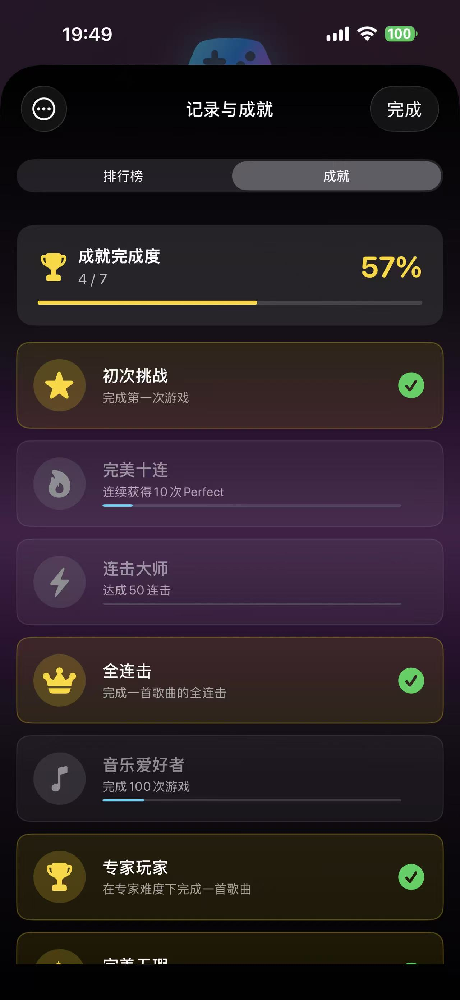
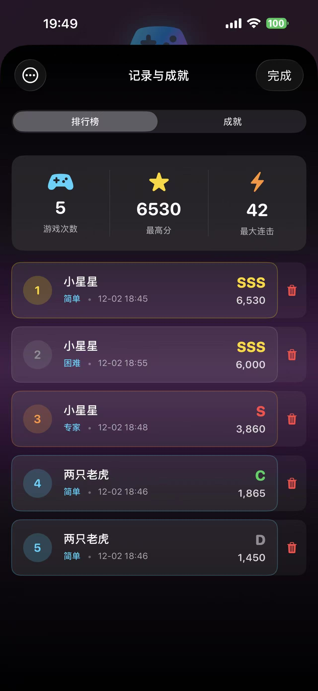

# TempoMaster - Juanwan Yayun (隽婉雅韵)

English | [简体中文](README.md)

<div align="center">


**A Music Learning App Born from a Father's Love · Helping Children Fall in Love with Musical Notation Through Games**

[](https://www.apple.com/ios)
[](https://swift.org)
[](https://developer.apple.com/xcode/swiftui/)
[](LICENSE)

[Story](#story) • [Features](#features) • [Screenshots](#screenshots) • [Quick Start](#quick-start)

</div>

---

## 💝 Story

This app was born from a father's love for his daughter.

To help my daughter **Juanwan** learn musical notation (jianpu), I developed this edutainment piano app. The name "Juanwan Yayun" (隽婉雅韵) is both an affectionate reference to my daughter and represents a beautiful vision for music education—letting children learn and grow joyfully through elegant melodies.

> "Music is the best gift, and companionship is the longest confession of love."

---

## 📖 Introduction

**TempoMaster (Juanwan Yayun)** is a music education app designed for iOS that perfectly combines electronic piano playing with fun games. Whether for music enlightenment, learning musical notation, or parent-child interaction, TempoMaster makes learning music simple and enjoyable.

### ✨ Why Choose TempoMaster

- 🎯 **Best Choice for Notation Learning** - Specially designed for children's jianpu (numbered notation) learning, starting with "Twinkle Twinkle Little Star"
- 🎮 **Gamified Learning** - "Colorful Notes" makes boring practice fun
- 🎹 **Easy to Use** - 16-key dual-row design that children can easily master
- 🎨 **Child-Friendly Visuals** - Colorful notes and 6 themes attract children's attention
- ??‍👧 **Parent-Child Interaction** - Achievement system lets parents witness every step of their child's growth
- 💯 **Completely Free** - No ads, no in-app purchases, pure music experience

---

## 📱 Screenshots

### Main Playing Interface

<div align="center">


*Colorful keys + note display, learn while playing*

</div>

### Themes & Song Library

<div align="center">



*6 color themes | Classic children's song library*

</div>

### Game Mode

<div align="center">




*Fun gamified learning: 4 difficulty levels for different skill levels*

</div>

### Achievements & Leaderboard

<div align="center">



*Track growth journey, witness progress moments*

</div>

---

## 🎯 Core Features

### 🎹 Playing & Learning Mode

#### Jianpu Enlightenment Design

- **Colorful Note Labels**: Each key has jianpu numbers (1-7, i)
- **Real-time Note Display**: Shows corresponding jianpu symbols while playing
- **Dual-Row Keyboard Layout**: High and low notes separated, clear pitch range
- **One-Key Playback**: Play sample songs and learn along

#### Children's Song Library

- 🌟 **Twinkle Twinkle Little Star** - Most classic enlightenment song
- 🐯 **Two Tigers** - Catchy children's song
- 🎵 **Ode to Joy** - Advanced level improvement
- Support switching between jianpu/staff notation display

### 🎮 Game Mode - Colorful Notes

Turn learning into a game, make boring practice fun!

#### 4 Difficulty Levels

- 🟢 **Easy** - Notes fall slowly, suitable for beginners
- 🟡 **Normal** - Moderate pace, consolidate basics
- 🟠 **Hard** - Challenge reaction speed
- 🔴 **Expert** - Advanced player's path

#### Achievement Motivation System

- 🌟 **First Challenge** - Complete first game
- ?? **Perfect Ten** - Get 10 consecutive Perfects
- ⚡ **Combo Master** - Achieve 50 combo
- 👑 **Full Combo** - Perfect performance of a song
- 🎵 **Music Lover** - 100 cumulative practices
- 🏆 **Expert Player** - Complete expert difficulty

### 🎨 Personalized Themes

6 color schemes, let children choose their favorite style:

- Classic Purple-Pink, Ocean Blue, Sunset Orange, Forest Green, Gem Red, Random Color

### 🔊 Sound Effect Enhancement

4 sound effects make performance more interesting: Reverb, Delay, Distortion, Chorus

---

## 🏗️ Technical Implementation

### Core Technologies

```
SwiftUI 4.0          - Native iOS UI Framework
AVFoundation         - Professional Audio Processing
SpriteKit           - Smooth Game Animation
Combine             - Reactive Architecture
Swift 5.9           - 100% Swift Development
```

### Project Structure

```
Piano/
├── app/
│   └── PianoApp.swift              # App Entry
├── Features/
│   └── Piano/
│       └── PianoMainView.swift     # Main Interface
├── Components/
│   ├── Atoms/                      # Atomic Components
│   │   └── GlassButton.swift
│   ├── Molecules/                  # Molecular Components
│   │   └── PianoKeyButton.swift
│   └── Organisms/                  # Organic Components
│       ├── AboutView.swift
│       ├── ControlPanel.swift
│       ├── EffectControlPanel.swift
│       └── SongSelectionPanel.swift
├── Core/
│   ├── SpriteKit/                  # Game Engine
│   │   ├── GameScene.swift
│   │   ├── SpriteKitGameView.swift
│   │   └── SpriteKitGameViewModel.swift
│   ├── Theme/
│   │   └── ThemeManager.swift      # Theme Management
│   └── AppState.swift              # App State
├── models/
│   ├── AudioManager.swift          # Audio Management
│   ├── GameModels.swift            # Game Data Models
│   ├── GameStateManager.swift      # Game State Management
│   ├── Note.swift                  # Note Model
│   ├── NoteFallEngine.swift        # Note Fall Engine
│   ├── SheetMusicParser.swift      # Jianpu Parser
│   └── SongScheduler.swift         # Song Scheduler
├── playlist/
│   └── Song.swift                  # Song Model
└── views/
    ├── GameMainView.swift          # Game Main Interface
    ├── GameResultView.swift        # Result Page
    ├── LeaderboardView.swift       # Leaderboard
    └── SheetMusicEditorView.swift  # Jianpu Editor
```

### Core Feature Implementation

#### Audio System

- **AVAudioEngine** - Audio processing engine
- **AVAudioPlayerNode** - Multi-track synchronized playback
- **AVAudioUnitReverb/Delay/Distortion** - Real-time effect processing
- **Low Latency Design** - Optimized audio buffer configuration

#### Game Engine

- **SpriteKit Scene** - High-performance 2D rendering
- **Physics Engine Integration** - Smooth note fall animation
- **Collision Detection** - Precise judgment system
- **Particle System** - Gorgeous visual effects

#### State Management

- **Combine Framework** - Reactive data flow
- **ObservableObject** - MVVM architecture
- **@Published** - Automatic UI updates
- **AppStorage** - Persistent configuration

---

## 💻 Quick Start

### System Requirements

- iOS 16.0 or higher
- iPhone device
- Xcode 15.0+ (for developers)

### Installation

1. **Clone Repository**
   
   ```bash
   git clone https://github.com/GPTAlgoPro/TempoMaster.git
   cd TempoMaster
   ```

2. **Open Project**
   
   ```bash
   open Piano.xcodeproj
   ```

3. **Run App**
   
   - Connect iPhone device or use simulator
   - Select target device
   - Click Run (⌘R)

---

## 📚 Usage Recommendations

### For Parents

**Progressive Learning**:

1. First let children recognize colorful keys and corresponding jianpu numbers
2. Play sample songs, let children follow the melody
3. Start with "Easy" difficulty in game mode
4. Practice 15-20 minutes daily to maintain interest

**Encouragement First**:

- Pay attention to achievement system, praise child's progress promptly
- Don't force scores, focus on cultivating interest
- Play together with children, enhance parent-child relationship

### Learning Path

**Week 1**: Recognize notes → Learn "Twinkle Twinkle Little Star"  
**Week 2**: Challenge game easy mode → Unlock "First Challenge" achievement  
**Week 3**: Learn "Two Tigers" → Try normal difficulty  
**Week 4**: Free practice → Aim for high scores

---

## 🎯 Future Plans

### v1.0.0 (Current Version)

- ✅ Basic jianpu learning function
- ✅ 3 classic children's songs
- ✅ Gamified learning mode
- ✅ Achievement motivation system

### v1.1.0 (Planned)

- 🔄 More children's song library (10+ songs)
- 🔄 Practice mode: Slow tempo following
- 🔄 Parent mode: Learning reports

### v2.0.0 (Concept)

- 🔄 iCloud progress sync
- 🔄 iPad large screen adaptation
- 🔄 Recording sharing function

---

## 👨‍💻 About Developer

**Developer**: Kai Sun  
**Motivation**: A music enlightenment gift created for daughter Juanwan  
**Version**: 1.0.0  
**Updated**: December 2025

> "This app carries a father's love for his daughter, and I hope it can also help more children fall in love with music."

---

## 📄 License

This project is licensed under the MIT License - see the [LICENSE](LICENSE) file for details

---

## 🤝 Contributing

If you are also a parent or developer who cares about children's music education, welcome to:

- 🐛 Submit bug reports
- 💡 Share usage experience and improvement suggestions
- 🎵 Contribute more songs suitable for children
- ⭐ Give the project a Star to let more people see it

**Submit via**: [GitHub Issues](https://github.com/GPTAlgoPro/TempoMaster/issues)

---

## 🙏 Special Thanks

- 💝 **Juanwan** - The most important "product manager" and tester of this app
- 🍎 **Apple** - SwiftUI and AVFoundation frameworks
- 🎵 **Music Educators** - Valuable suggestions provided
- 👨‍👩‍👧‍👦 **All parents who care about children's growth**

---

<div align="center">

**Grow with Love, Enlighten with Music** 🎵

Dedicated to my daughter Juanwan and all children who love music

Made with 💖 by Kai Sun

[⬆ Back to Top](#tempomaster---juanwan-yayun-隽婉雅韵)

</div>